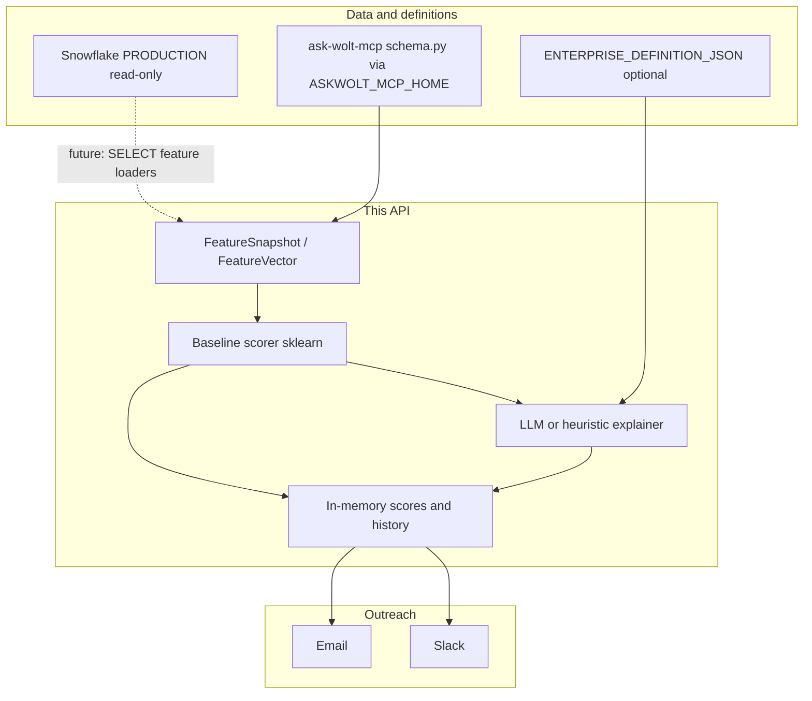

# Enterprise churn detection & alerting

Web service and API that score **Enterprise (ENT) restaurant venues** for churn risk (per product), surface **root-cause hypotheses**, support **Slack/email playbooks**, and stay aligned with **Wolt’s Snowflake warehouse** via the same **`schema.py`** used by [AskWoltAI MCP](https://github.com/rajivkhattar-commits/ask-wolt-mcp).

---

## How the pieces connect



### 1) When do we call Snowflake, and how?

| Context | Behavior |
|--------|----------|
| **This API today** | Does **not** send INSERT, UPDATE, DELETE, or DDL to Snowflake. Optional **read-only** client (`backend/app/snowflake_db/client.py`) is for **future** SELECT-based feature loading. |
| **Diagnostics** | `GET /api/diagnostics/snowflake` reports whether credentials are set and whether a connection succeeded (no DML). |
| **AskWoltAI MCP (Cursor)** | Separate process: natural language → SQL → answers. Use for **discovery** and validation, not for this API’s runtime path. |
| **Snowflake MCP (Cursor)** | Raw SQL against Snowflake; same idea — **interactive**, not embedded in the API. |

Production scoring currently uses **demo/in-memory feature snapshots** (`backend/app/store/memory.py`). Wiring real metrics means adding jobs that **SELECT** from Snowflake (or from dbt marts) and building `FeatureSnapshot` rows — still **read-only** from this service’s perspective.

### 2) How do we keep track of inputs to the model?

- **Structured input:** [`FeatureSnapshot`](backend/app/contracts/features.py) + [`FeatureVector`](backend/app/contracts/features.py) — numeric fields (orders, GMV deltas, config errors, etc.) and optional `raw_signals`.
- **Where they live during a run:** the in-memory store holds scores, explanations, and history for the API/UI.
- **Demo venues / features:** [`data/demo_feature_snapshots.json`](data/demo_feature_snapshots.json) seeds the in-memory store — **~900+ feature snapshots** (one per [`data/demo_venues.csv`](data/demo_venues.csv) row, plus extra **multi-surface** rows: same `venue_id`, different `product`, for grouped UI / dry-run tests). Regenerate with [`scripts/build_demo_feature_snapshots.py`](scripts/build_demo_feature_snapshots.py). **Brand / city / country** for the UI come from [`data/venue_enrichment.json`](data/venue_enrichment.json) (build with [`scripts/build_venue_enrichment.py`](scripts/build_venue_enrichment.py)); replace with a Snowflake join on `venue_id` → merchant / `d_merchant_tier` in production. MCP sourcing notes: [`data/mcp_exploration_notes.txt`](data/mcp_exploration_notes.txt).
- **Snowflake scale check (optional):** this app does not bulk-ingest the warehouse into the table UI. To estimate how large a full mart would be (e.g. ~1500 ENT venues worldwide × several product surfaces), configure `backend/.env` and run [`scripts/snowflake_rowcount_probe.py`](scripts/snowflake_rowcount_probe.py) — optionally point `SNOWFLAKE_PROBE_SQL_FILE` at a `COUNT(*)` query (template: [`sql/ent_venue_product_count_example.sql`](sql/ent_venue_product_count_example.sql); adjust table names to your schema).
- **Historical scores (warehouse):** DBA/Analytics table template [`sql/churn_score_history_analytics.sql`](sql/churn_score_history_analytics.sql) and upload-friendly example [`data/score_history_upload_example.csv`](data/score_history_upload_example.csv) — **not** populated by this API.
- **Labels for evaluation:** [`data/churn_labels_example.csv`](data/churn_labels_example.csv) (MCP-derived narratives + matching venue IDs) and [`ChurnLabelRow`](backend/app/contracts/features.py) for backtests ([`GET /api/backtest`](backend/app/main.py)).
- **Enterprise copy:** [`data/enterprise_churn_definition.json`](data/enterprise_churn_definition.json) is loaded by default (AskWoltAI MCP–derived interim text, per-surface soft/hard churn and Snowflake hints). Override with **`ENTERPRISE_DEFINITION_JSON`** when you want env-only config. Churn is modeled **per Wolt product surface** — see [`ProductCode`](backend/app/contracts/cohort.py) (`classic`, `wolt_plus`, `takeaway_pickup`, `drive`, `wolt_for_work`, `preorder`, …).

### 3) How does the scoring model work?

- **Baseline:** [`BaselineChurnModel`](backend/app/ml/baseline.py) — loads **`baseline.joblib`** from `CHURN_MODEL_DIR` when present; otherwise uses the built-in **heuristic** on `FeatureVector` (good risk spread for demos). Train and `save()` when you have real labels.
- **Churn-type mix:** heuristic decomposition into soft/hard/operational-style probabilities (`churn_type_probs`).
- **Training / backtest:** CSV labels via [`run_backtest`](backend/app/ml/backtest.py); fit `BaselineChurnModel` on your features and `save()` to `baseline.joblib` for LR scoring.

### 4) What does the agent do after scoring?

After `risk_score` and `churn_type_probs` are computed, the **explainer** ([`backend/app/agent/explainer.py`](backend/app/agent/explainer.py)) runs:

- If **`LLM_API_KEY`** / **`OPENAI_API_KEY`** is set: OpenAI-compatible **JSON** hypotheses (renovation, sales decline, misconfiguration, …) with evidence lines.
- Otherwise: **deterministic rules** from the same features.
- If **`ENTERPRISE_DEFINITION_JSON`** is set, or the default **`data/enterprise_churn_definition.json`** loads, that text is **appended** to the LLM context so churn reasons align with ENT definitions.

Results are stored with the score in memory for the UI and outreach templates.

---

## Canonical joins and `schema.py` (production without MCP)

The AskWoltAI repo’s **`schema.py`** defines **`SCHEMA_DESCRIPTION`** — the same table/join documentation exposed as MCP **`get_schema`**. This project loads it **at runtime** when **`ASKWOLT_MCP_HOME`** points to a clone of `ask-wolt-mcp` (no MCP process required).

- **`GET /api/definitions/enterprise`** returns `canonical_joins.schema_reference` (excerpt + metadata) when the clone is present.
- Optional **`CANONICAL_JOINS_JSON`** overrides structured joins for your deployment.

**Cursor MCP** is still useful for **interactive** questions; **production** relies on **disk path + env**, not MCP connectivity.

### Development: clone updates + live MCP fallback

- **Stay current:** run `bash scripts/sync-askwolt-mcp.sh` before deep work on joins or cohort SQL (uses `ASKWOLT_MCP_HOME`, default `~/ask-wolt-mcp`). It `git pull`s and reinstalls Python deps in that clone.
- **Debug API:** set **`DEBUG=true`** when running uvicorn. On startup the server **logs** if the clone is behind `origin/main`. With debug on:
  - **`GET /api/dev/askwolt-mcp`** — `behind` commit count, optional `changelog`, or `error` if not a git repo.
  - **`POST /api/dev/askwolt-mcp/sync`** — `git pull --ff-only` + `pip install -r requirements.txt` in the clone and clears the in-process schema cache.
- **Fallback when `schema.py` does not load:** `GET /api/definitions/enterprise` still returns **`canonical_joins.schema_reference.dev_fallback`**, pointing to **Cursor AskWoltAI MCP** tools (`get_schema`, `ask_wolt`, `run_wolt_sql`) so you can work against **live** schema in the IDE until the local clone imports cleanly.

Project rule (Cursor): [`.cursor/rules/askwolt-mcp-sync.mdc`](.cursor/rules/askwolt-mcp-sync.mdc).

---

## Installation (this repo)

```bash
cd churn-detection-alerting/backend
python3 -m venv .venv
source .venv/bin/activate
pip install -r requirements.txt
```

Optional: copy [`backend/.env.example`](backend/.env.example) to `backend/.env` and set `ASKWOLT_MCP_HOME`, LLM keys, etc.

**Frontend (optional):**

```bash
cd ../frontend
npm install
npm run build
```

Run API (enable dev endpoints + startup clone check with **`DEBUG=true`**):

```bash
cd backend
DEBUG=true PYTHONPATH=. uvicorn app.main:app --reload --host 127.0.0.1 --port 8000
```

Open `http://127.0.0.1:8000` if static assets were built.

### UI: default vs strict production (Vite)

Cutoff presets always set `GET /api/at-risk?min_risk=…` (0.0–1.0); **All accounts** uses `min_risk=0`.

| Build | Default (`VITE_STRICT_PROD` unset or not `true`) | Strict (`VITE_STRICT_PROD=true` at build time) |
|--------|----------------|-------------------------|
| **`npm run build`** or **`npm run dev`** | **Focus your pipeline** with tier presets + **Fine-tune cutoff** slider (dev only) + other dev-tagged actions. | Same **Focus your pipeline** with presets only; fine-tune slider and other dev controls hidden or disabled. |

Copy [`frontend/.env.example`](frontend/.env.example) to `frontend/.env` if you want to pin `VITE_STRICT_PROD` locally. To rebuild static files with the full UI before using [`scripts/start-churn-tool-local.sh`](scripts/start-churn-tool-local.sh), run `CHURN_REBUILD_UI=1 ./scripts/start-churn-tool-local.sh` (see script header).

---

## AskWoltAI MCP (Cursor) — installation

**Prerequisites:** Node.js 18+, Python 3.11+, Git.

### 1. Clone and Python venv

```bash
git clone https://github.com/rajivkhattar-commits/ask-wolt-mcp.git ~/ask-wolt-mcp
cd ~/ask-wolt-mcp
python3 -m venv .venv
source .venv/bin/activate
pip install -r requirements.txt
```

### 2. Create `.env` from the template

```bash
cp .env.example .env
```

Edit `.env` and set at least:

| Variable | Description |
|----------|-------------|
| `LLM_BACKEND` | `claude` (local Claude CLI), `gemini`, or `openai` |
| `SNOWFLAKE_ACCOUNT` | Your Snowflake account identifier (Snowflake UI → profile, or `SELECT CURRENT_ACCOUNT()`) |
| `SNOWFLAKE_USER` | **Your Wolt Okta email** (e.g. `you@wolt.com`) — replace with your real address |
| `SNOWFLAKE_WAREHOUSE` | e.g. `EXPLORATION_L` |
| `SNOWFLAKE_DATABASE` | `PRODUCTION` |
| `SNOWFLAKE_ROLE` | `BASE_USER` |
| `SNOWFLAKE_AUTH_MODE` | `sso` for browser login |

**Gemini:** set `GEMINI_API_KEY` and `pip install google-genai`.  
**OpenAI:** set `OPENAI_API_KEY` and `pip install openai`.  
**Claude:** ensure `claude --version` works (Claude Code / CLI per Wolt IT).

### 3. Add MCP servers in Cursor

Edit **`~/.cursor/mcp.json`** (create if missing) and add entries for:

- **`snowflake`** — `npx -y snowflake-mcp` with `SNOWFLAKE_ACCOUNT`, `SNOWFLAKE_USERNAME` (same as Okta email), `SNOWFLAKE_AUTHENTICATOR=externalbrowser`, `SNOWFLAKE_WAREHOUSE`, `SNOWFLAKE_DATABASE`, `SNOWFLAKE_ROLE`.
- **`askwoltai`** — `command` = absolute path to `~/ask-wolt-mcp/.venv/bin/python3`, `args` = absolute path to `mcp_server.py`, `cwd` = `~/ask-wolt-mcp` (expanded).

Enable both under **Cursor → Settings → MCP** (toggle on; reload alone is not enough).

First Snowflake use opens a browser for SSO; token is cached for several hours.

### 4. Align this churn API with the same schema

Set for the churn backend:

```bash
export ASKWOLT_MCP_HOME=$HOME/ask-wolt-mcp
```

So **`GET /api/definitions/enterprise`** loads the same **`schema.py`** joins documentation without running MCP.

---

## API quick reference

| Endpoint | Purpose |
|----------|---------|
| `GET /api/definitions/enterprise` | ENT text, `canonical_joins` (schema + env), MCP guidance |
| `GET /api/diagnostics/snowflake` | Read-only Snowflake connection diagnostics |
| `GET /api/at-risk` | Latest risk scores (`min_risk` 0–1; UI presets / slider set this unless strict build) |
| `GET /api/ui/copy` | Product labels + scoring help text for the UI |
| `POST /api/score/run` | Batch score |
| `POST /api/outreach` | Slack/email (dry-run supported) |
| `POST /api/feedback` | In-memory feedback |
| `GET /api/backtest` | Label file evaluation |

---

## Test question (AskWoltAI MCP)

> How many active ENT venues are there in Finland right now?

---

## Further reading

- [`sql/mcp_workflow.txt`](sql/mcp_workflow.txt) — analyst workflow with MCP + env export.
- [`sql/snowflake_objects_reference.txt`](sql/snowflake_objects_reference.txt) — no DML from this service.
